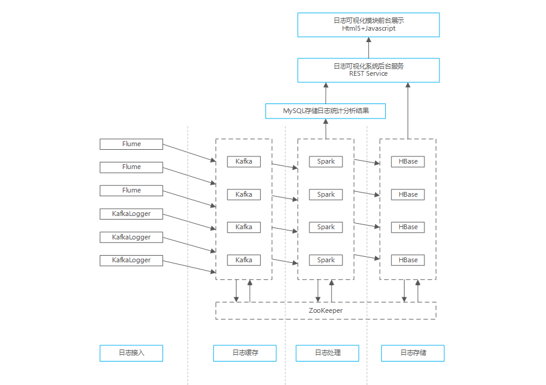

# 统一日志系统的设计思路  

## 需求分析   
 　　logboard设计的目标是统一管理各个子系统的日志，包括日志的收集、存储、监控、查询、分析、展示，使用异步的日志系统减少各个系统的开销、降低日志与系统的耦合度、提高日志模块的通用性。
 　　可能的需求如下： 
   
- 问题快速定位，分析故障
- 异常信息分析
- 日志预警
- 问题追责
- 用户行为挖掘
- 日志监控、系统监控
- 日志关联、错误匹配、问题探索
- 多维度分析
- 实时可视化  
---
- 日志负载均衡
- 日志服务发现
- 日志高可用
- 日志系统滚动升级
- 系统硬件伸缩
- ...　　  
## 技术路线

## 日志采集  
日志采集模块的目标是收集各个子系统（主要在Windows平台）产生的日志，方便后续的存储与分析。
#### 日志来源    
重要日志处理成半结构化，对非结构化的日志*暂不处理*。

- 业务日志（具体应用模块产生，处理成半结构化）  
- 框架/系统日志（使用的开发框架产生）  
- 数据库/系统日志（数据库默认日志产生）  
- 硬件日志（设备/操作系统产生）     
#### 日志规范化  
统一日志的格式能够方便日志存储和分析，提高效率。
将变化较少的数据存储在MySQL-LogMeta的LogApps表、LogContacts表，将实际日志存储在HBase的LogRecords表

**LogApps**  

|Fields               |      DESC            |
|:--------------------|:---------------------|
| LA_ID               |自增ID                 |
| LA_NAME             |子系统名                |
| LA_CODE             |子系统编号              |
| LA_IP               |子系统服务器IP列表       |
| LA_PLATFORM         |子系统操作系统或框架环境  |
| LA_DESCRIPTION      |子系统描述              |
| LA_NOTES            |备注                   |
| CREATE_TIME         |创建时间                |
| CREATE_BY           |创建人                  |
| UPDATE_TIME         |修改时间                |
| UPDATE_BY           |修改人                  |

**LogContacts**  

|Fields               |      DESC            |
|:--------------------|:---------------------|
| LC_ID               |自增ID               |
| LC_APP_CODE         |子系统编号            |
| LC_APP_DEVOPS       |子系统运维负责人       |
| LC_DEVOPS_TEL       |负责人电话            |
| LC_DEVOPS_EMAIL     |负责人邮箱            |
| CREATE_TIME         |创建时间              |
| CREATE_BY           |创建人                |
| UPDATE_TIME         |修改时间              |
| UPDATE_BY           |修改人                |

**LogRecords**   

|Fields               |      DESC            |
|:--------------------|:---------------------|
| LR_ID               |自增ID                 |
| LR_APP_CODE         |日志来源子系统编号       |
| LR_DATETIME         |日志日期时间            |
| LR_USER_IP          |客户端IP/HOST          |
| LR_USER_ID          |用户ID                 |
| LR_USER_PLATFORM    |客户端系统              |
| LR_LOG_MSG          |日志内容                |
| LR_LOG_LEVEL        |日志级别                |
| LR_LOG_TYPE         |日志类别                |
| LR_LOG_TAG          |日志标签                |

-----------------------------------

**可选字段**

|Fields               |      DESC            |
|:--------------------|:---------------------|
| LR_APP_MODULE       |应用模块               |
| LR_LOG_THREAD       |线程                   |
| LR_LOG_LOCATION     |文件位置               |
| LR_LOG_EXP          |异常信息               |
| LR_LOG_INPUT        |用户输入，或输入参数     |
| LR_LOG_OUTPUT       |输出信息               |
| LR_LOG_COMMENTS     |程序员注释             |
| LR_LOG_TOPIC        |日志主题               |

#### 日志收集方法
**文件采集**
- 使用FLUME的agent主动收集本地log文件，sink到缓存服务器  

**流式采集**
**？？？**哪种效率高
- 使用KafkaLog4jAppender直接将日志消息输出到缓存服务器  
- 使用kafkaProducer直接将日志信息输出到缓存服务器

## 日志存储
日志存储的目标是存储原始日志方便排查问题。
#### 日志缓存Kafka 只存7天
日志源产生的日志先输出到缓存，以减轻数据存储服务器的压力。
#### 日志存储HBase 只存15/30天
日志原始数据保存在HBase，以提供下载和浏览服务。
#### 日志备份
采用的分布式的技术方案，自带备份功能

## 日志统计分析
日志的统计分析模块同时考虑通用的和具体业务的统计分析。  

#### 通用统计
**计数**
Spark Streaming 
**过滤**
去重条件
无效条件
**TOPN**

#### 业务统计
搜索词统计
用户点击统计

## 日志查询

#### 查询维度
TYPE
TAG
APP_CODE

#### 查询方法及优化

## 日志可视化

#### 可视化模块
异常信息
日志统计信息
用户行为信息

#### 可视化方法
MySQL + Spring Boot + MyBatis + JS + Bootsrap 